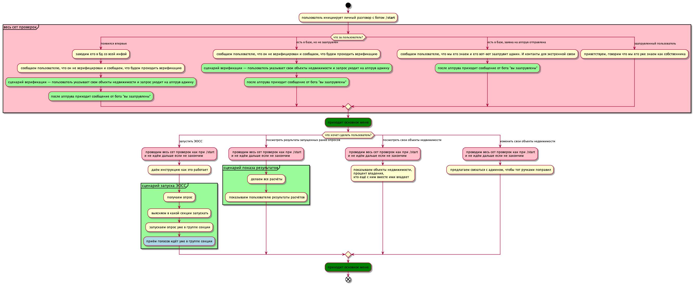

# Как это всё работает (целевое состояние)

У бота должно быть два режима:

1. Работа в режиме общения напрямую с пользователем
2. Работа в группах

## Работа напрямую с пользователем

Ниже представлена логическая схема того, как должно идти взамодействие с пользователем.

Логика кода отличается в силу асинхронности происходящего.

## Работа в группах

TODO: предстоит описать